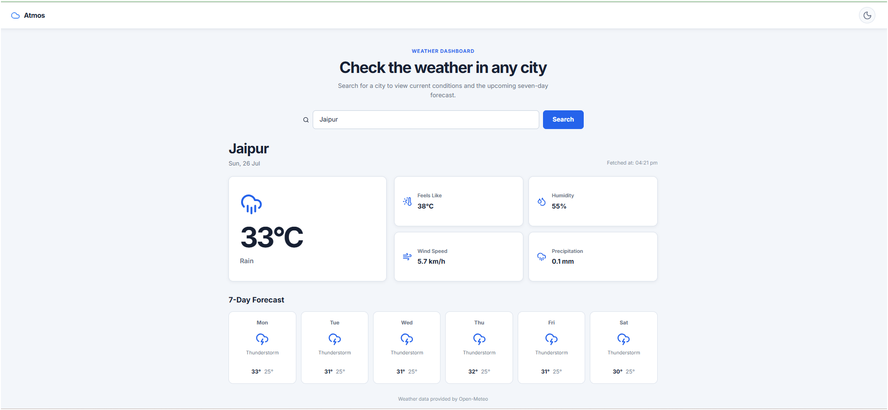

# Atmos — Full-Stack Weather Dashboard

**Company:** CODTECH IT SOLUTIONS  
**Name:** ANURAG KUMAR  
**Intern ID:** CTIS4487  
**Domain:** FULL STACK WEB DEVELOPMENT  
**Duration:** 16 WEEKS  
**Mentor:** NEELA SANTOSH KUMAR  

---

## Project Overview

This project is a responsive full-stack weather dashboard built with React, Node.js, and Express.js.

The application uses the Open-Meteo weather and geocoding APIs to search for cities and display current weather conditions along with a multi-day forecast.

The project includes a clean product-style interface, loading states, error handling, light and dark themes, city autocomplete, and a timestamp showing when the application successfully fetched the weather data.

---

## Features

- Search for cities worldwide
- Live city suggestions using a geocoding API
- Current temperature and weather condition
- Feels-like temperature
- Humidity information
- Wind-speed information
- Precipitation details
- Multi-day weather forecast
- Weather-condition icons based on WMO weather codes
- Actual data-fetch time display
- Loading skeletons while data is being fetched
- Clear error messages when requests fail
- Light and dark theme support
- Responsive layout for desktop, tablet, and mobile devices
- Open-Meteo data-source attribution

---

## Tech Stack

### Frontend

- React.js
- Vite
- JavaScript
- CSS
- Axios
- Lucide React

### Backend

- Node.js
- Express.js
- Axios
- CORS
- dotenv

### External APIs

- Open-Meteo Forecast API
- Open-Meteo Geocoding API

---

## Project Structure

```text
.
├── client/
│   ├── public/
│   ├── src/
│   │   ├── assets/
│   │   ├── components/
│   │   │   ├── SearchBar.jsx
│   │   │   ├── SkeletonLoader.jsx
│   │   │   └── WeatherCard.jsx
│   │   ├── App.css
│   │   ├── App.jsx
│   │   ├── index.css
│   │   └── main.jsx
│   ├── package.json
│   └── vite.config.js
│
├── server/
│   ├── .env
│   ├── index.js
│   └── package.json
│
└── README.md
```

---

## Application Workflow

1. The user enters a city name in the search box.
2. The frontend sends a request to the backend city-search endpoint.
3. The backend retrieves matching city suggestions from the Open-Meteo Geocoding API.
4. The user selects a city.
5. The frontend sends the selected city coordinates to the backend weather endpoint.
6. The backend retrieves weather information from the Open-Meteo Forecast API.
7. The frontend displays:
   - Current temperature
   - Weather condition
   - Feels-like temperature
   - Humidity
   - Wind speed
   - Precipitation
   - Forecast data
   - Fetch time

---

## Local Setup

### Prerequisites

Make sure the following software is installed:

- Node.js
- npm
- Visual Studio Code or another code editor

---

## Backend Setup

Open a terminal in the project folder and navigate to the backend directory:

```bash
cd server
```

Install backend dependencies:

```bash
npm install
```

Start the backend server:

```bash
npm start
```

The backend runs on:

```text
http://localhost:5000
```

Keep this terminal running.

---

## Frontend Setup

Open another terminal and navigate to the frontend directory:

```bash
cd client
```

Install frontend dependencies:

```bash
npm install
```

Start the Vite development server:

```bash
npm run dev
```

The frontend normally runs on:

```text
http://localhost:5173
```

Open this address in a browser.

---

## API Reference

### Search Cities

```http
GET /api/search?q={cityName}
```

Example:

```http
GET /api/search?q=Jaipur
```

This endpoint returns matching cities with their names, regions, countries, latitudes, and longitudes.

---

### Fetch Weather

```http
GET /api/weather?lat={latitude}&lon={longitude}&city={cityName}
```

Example:

```http
GET /api/weather?lat=26.9124&lon=75.7873&city=Jaipur
```

This endpoint returns:

- Location name
- Current weather information
- Temperature
- Feels-like temperature
- Humidity
- Wind speed
- Precipitation
- Weather code
- Forecast data

---

## Important Code Improvements

During project completion and testing, the following improvements were made:

- Reinstalled frontend and backend dependencies
- Resolved npm dependency vulnerabilities
- Fixed ESLint errors
- Improved React state handling
- Removed invalid nested HTML elements
- Added proper API error handling
- Added city autocomplete support
- Added Open-Meteo attribution
- Added the actual weather-fetch timestamp
- Replaced the original glassmorphism layout with a cleaner product-style dashboard
- Improved desktop and mobile responsiveness
- Improved forecast-card layout
- Added light and dark theme support
- Verified the production build

---

## Validation and Testing

The project was tested using the following commands.

### Security Audit

Run inside both the `client` and `server` directories:

```bash
npm audit
```

Expected result after fixes:

```text
found 0 vulnerabilities
```

### Frontend Lint Check

Run inside the `client` directory:

```bash
npm run lint
```

The command should complete without ESLint errors.

### Frontend Production Build

Run inside the `client` directory:

```bash
npm run build
```

The production build was completed successfully.

Example successful output:

```text
✓ modules transformed
✓ built successfully
```

The generated production files are stored in the `client/dist` directory.

---

## Testing Checklist

The following cases should be checked before final submission:

- Search for Jaipur
- Search for Delhi
- Search for another valid city
- Test city autocomplete
- Test an invalid or incomplete city name
- Test the loading state
- Stop the backend and verify the error message
- Test light mode
- Test dark mode
- Test the application on a narrow mobile screen
- Run `npm run lint`
- Run `npm run build`

---

## Screenshots


---

## Data Source

Weather and geocoding data are provided by Open-Meteo.

The application may display slightly different values from Google Weather or other weather services because different providers can use different weather models, observation sources, locations, and update times.

---

## Limitations

- The project currently runs locally.
- The backend URL is configured for `localhost`.
- Weather values may differ slightly from other weather providers.
- The application requires an internet connection to fetch weather data.
- The frontend and backend must both be running locally.
- Deployment configuration is not yet included.

---

## Future Improvements

Possible future enhancements include:

- Automatic current-location weather
- Hourly weather forecast
- Air-quality information
- Weather alerts
- Recent city-search history
- Favourite cities
- Unit switching between Celsius and Fahrenheit
- Backend rate limiting
- Request caching
- Environment-based frontend API URL
- Cloud deployment
- Automated testing

---

## Author

**Anurag Kumar**  
Full Stack Web Development Intern  
CODTECH IT SOLUTIONS

---

## Acknowledgement

This project was completed as part of the Full Stack Web Development internship task at CODTECH IT SOLUTIONS under the mentorship of Neela Santosh Kumar.